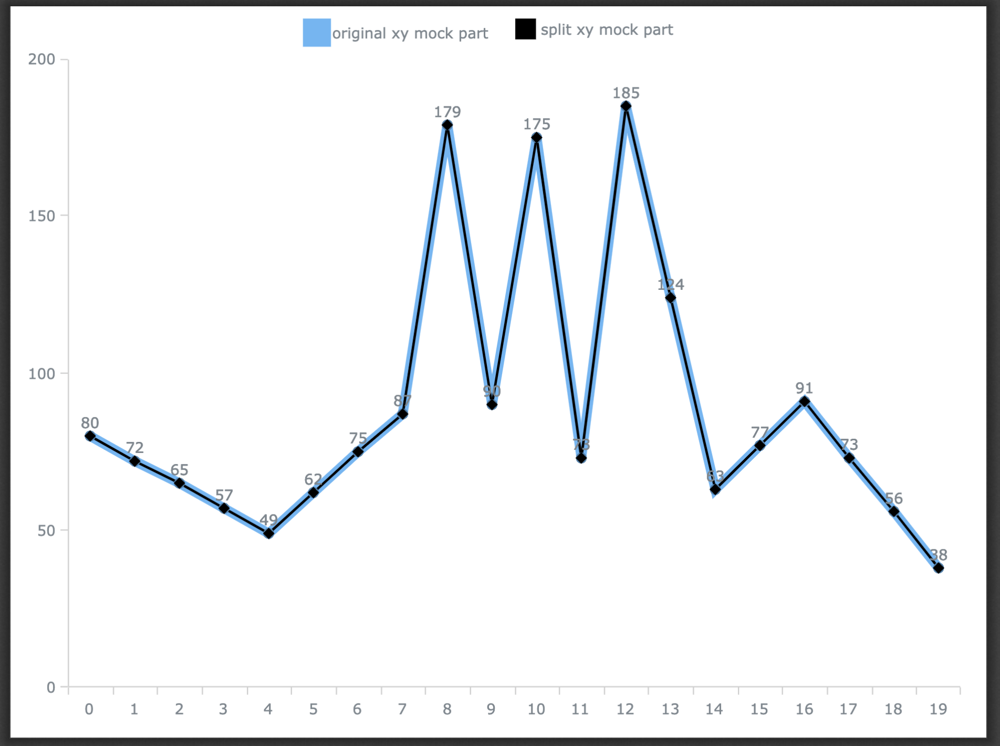

# Project Target

1. Verify part linearity is equal to global linearity ?

2. Verify Flow

    1. random 100 number, random insert null -> originalXY Array
    2. linear full null for verify
    3. slice part array -> originalXYP1
    4. linear full originalXYP1 null value -> mergeYofP1
    5. verify originalXY.slice and mergeYofP1

### Result ⬇️⬇️⬇️ 🤩

)